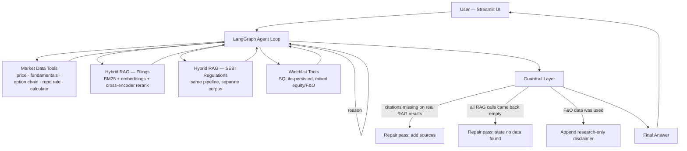

# 📈 FinSight India

**An agentic research assistant for Indian cash equity and F&O markets** — built end-to-end over 6 weeks: raw tool calling → an agent loop → hybrid RAG over real filings and SEBI regulations → persisted memory → RAGAS + tool-call evals → citation/disclaimer guardrails and public deployment.

**Live demo:** https://finsight-ind.streamlit.app/
*(Free-tier hosting — the app may need a moment to wake up if it's been idle, and sleep until then.)*

---

## What it does

Ask it things like:
- *"Is TCS's P/E higher than Infosys's, and is there unusual options activity building up in NIFTY this week?"*
- *"What did Reliance's latest filing say about Jio's subscriber growth?"*
- *"Has SEBI changed F&O lot-size rules recently?"*

The agent decides on its own which of 10 tools to call — live price/fundamentals lookups, an NSE option chain, the RBI repo rate, hybrid search over real company filings, hybrid search over SEBI circulars, and a persisted watchlist — chains as many as a question needs, and answers with citations pointing back to the actual source document, never a bare assertion.

---

## Architecture



Retrieval itself is two independent corpora — real company filings/concalls and SEBI circulars — each chunked, embedded (`all-MiniLM-L6-v2`), stored in ChromaDB, retrieved via **BM25 + embedding similarity**, then re-scored by a **cross-encoder** for final precision. The agent picks the right corpus per question on its own; it isn't hardcoded per query type.

---

## Key engineering decisions

- **Verification over prompt reliance.** Citation enforcement and the F&O disclaimer aren't just system-prompt instructions — they're code that inspects the actual tool-call log after every answer and triggers a targeted repair pass if a claim lacks a real source, or if F&O data shipped without the required disclaimer.
- **Two independent hard caps.** `MAX_ITERATIONS` limits reasoning turns; `MAX_TOOL_CALLS_PER_QUESTION` separately limits total tool executions, since one reasoning turn can request several tool calls at once — conflating the two was a real gap found and fixed during build.
- **Real bugs found by testing against real data**, not assumed correct from reading the code — repeated across every week of this build. A few examples: a citation check that initially accepted a bare company-name mention as "cited" (too loose — tightened to require the actual source filename); a cap-recovery path that could silently discard an already-correct answer; RAGAS's own broken upstream import, worked around with a compatibility shim rather than downgrading and breaking other dependencies.
- **Thin adapters, one implementation per concern.** `retrieval_tools.py`, `watchlist_tools.py`, and `deploy/app.py` all contain zero duplicated logic — they wrap `retrieval.py`, `watchlist.py`, and `agent.py` respectively, so a fix made in one place is inherited everywhere it's used, never re-implemented and re-tested twice.

---

## Eval results (Week 5)

Scored against a held-out 33-question set spanning all 5 tool types plus multi-hop combinations.

**Tool-call correctness** (does the agent call the right tools?):

| Category | Recall | Precision |
|---|---|---|
| Overall | **1.000** | 0.701 |
| Filing | 1.000 | 0.525 |
| Fundamentals | 1.000 | 0.840 |
| Multi-hop | 1.000 | 0.567 |
| Option chain | 1.000 | 0.767 |
| Price | 1.000 | 0.800 |
| Regulation | 1.000 | 0.756 |

Recall was a clean 1.000 throughout. Precision losses were manually read and classified, not left as raw numbers: **4 genuine failures** (all traced to the same root cause — over-searching past a sufficient answer, hitting the iteration cap, and losing the answer during recovery — found and fixed across 4 rounds of patches), **2 partial answers** (facts correctly recovered but the interpretive question not fully answered), and **9 cases of good-faith extra rigor** (additional tool calls that produced a *better* answer, not a worse one).

**Retrieval quality (RAGAS)** — regulations retrieval meaningfully outperformed filings:

| Corpus | Context Precision | Context Recall |
|---|---|---|
| Filings | 0.375 | 0.250 |
| Regulations | 0.769 | 0.800 |

---

## Tech stack

| Layer | Tool |
|---|---|
| LLM | Google Gemini (`gemini-3.5-flash`) |
| Agent orchestration | LangGraph `StateGraph` |
| Retrieval | Hybrid BM25 + `sentence-transformers` embeddings + cross-encoder reranking, via ChromaDB |
| Market/F&O data | `yfinance`, `jugaad-data` (NSE option chains, RBI repo rate) |
| Memory | LangGraph checkpointer (session) + SQLite (persisted watchlist) |
| Evals | RAGAS (retrieval) + custom tool-call correctness scorer |
| Deployment | Streamlit Community Cloud |

---

## Project structure

```
FinSight/
├── tool_calling/       # Week 1 — 5 standalone tools, provider-agnostic
├── agent_loop/         # Week 2, 4, 6 — LangGraph agent, memory, watchlist, guardrails
│   └── agent.py        #   the whole agent: tools, loop, memory, citation/disclaimer enforcement
├── rag/                # Week 3 — ingestion, hybrid retrieval, RAG tools, Chroma DB
├── evals/              # Week 5 — eval set, RAGAS scoring, tool-call scoring, aggregate report
├── deploy/
│   └── app.py           # Week 6 — Streamlit UI, thin wrapper over agent.py
└── requirements.txt
```

---

## Running it locally

```bash
git clone https://github.com/RonitGupta2002/FinSight.git
cd FinSight
python -m venv venv
venv\Scripts\activate          # or source venv/bin/activate on Mac/Linux
pip install -r requirements.txt
```

Create a `.env` file in the project root:
```
GEMINI_API_KEY1=your-key-here
GEMINI_API_KEY2=your-second-key-here   # optional — enables rotation once the first hits its daily cap
```

Run the terminal agent directly:
```bash
cd agent_loop
python agent.py
```

Or run the full UI:
```bash
streamlit run deploy/app.py
```

---

## Known limitations

- **Free-tier daily quota (~20 requests/day/key).** The agent detects and rotates between multiple `GEMINI_API_KEYn` keys automatically, but heavy use can still exhaust all configured keys until the next daily reset.
- **Watchlist changes on the live demo are session-only.** Streamlit Community Cloud's free tier rebuilds the app container from GitHub on every redeploy/reboot, so anything added to the watchlist through the live app (not committed to the repo) won't durably persist. Running locally doesn't have this limitation.
- **Apps sleep after inactivity.** The first visit after idle time shows a short "waking up" screen — this is expected free-tier behavior, not a bug.
- **Filings retrieval is weaker than regulations retrieval** (0.375 vs. 0.769 precision) — a known, measured gap rather than an assumed one, tracked as an open item for future retrieval tuning.

## Possible extensions

- A critic/verifier agent that checks every claim against retrieved sources before the answer ships (sketched as an optional Week 7 in the original plan, not yet built).
- Persistent, non-ephemeral watchlist storage for the deployed instance (e.g. a hosted database instead of local SQLite).

---

Built by Ronit Gupta as a structured, self-directed 6-week project.
